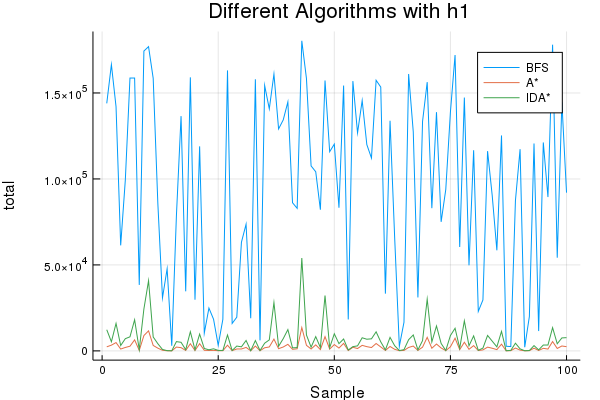

# Report

| 实验内容   | 学号     | 姓名   |
| ---------- | -------- | ------ |
| 启发式搜索 | 16337339 | 朱祎康 |

---

## 算法原理

### A*

A* 算法是一种启发式搜索算法，是**Dijkstra**算法和**BFS**的结合与改进。

A* 算法的实现基于**BFS**，维护一个队列$Q$ 来存放*待拓展节点*，每次从$Q$ 中选取$f$ 值最小的节点拓展。

$$f(x) = h(x) + g(x)$$

其中，$g(x)$ 表示从初始状态$s$到$x$的代价，$h(x)$ 是我们选取的启发式函数。

下面是$h(x)$ 需要满足的两条性质：

$$h(x) \leq h^\star(x), \forall x$$ 

$$h(x) \leq d(x, y) + h(y)$$

如果$h$ 满足第一条，称作$h$ 是**可采纳** 的，如果$h$ 同时满足第二条，称作$h$ 是**单调(一致)**的。

可以证明以下两条定理：

1. 如果$h$ 是可采纳的，那么A* 是完备的（总能找到解）也是最优的（第一个找到的解就是最优解）
2. 如果$h$ 是单调的，那么$\forall x$， 第一次到达$x$， 就是最优的$st\rightarrow x$。

当$h(x) = 0, \forall x$， A* 算法退化为**Dijkstra** 算法。


普通的A* 算法：

```pseudocode
Function A_star(st)
	Q <- empty priority queue
	push st into Q with priority 0
	g[st] <- 0
	pre[st] <- null
	
	while Q is not empty
		x <- pop Q with lowest priority
		if x = ed
			reconstruct the path from st to ed
			return True
		end
		for all y which x can arrive
			if y in Q
				if g[y] > g[x] + 1
					g[y] <- g[x] + 1
					modify y with priority g[y] + h(y)
				end
			else
				g[y] <- g[x] + 1
				pre[y] <- x
				push y into Q with priority g[y] + h(y)
			end
		end
	end
	return False
end
```


如果$h$ 满足单调性，第一次访问到某个节点$x$，一定就是从起点$s$ 到$x$ 的最优路径。

所以可以维护一个集合，记录已经访问过的节点，如果$y$ 已经访问过，那么不再放入$Q$ 中。

带**环检测**的A* 算法：

```pseudocode
Function A_star(st)
	Q <- empty priority queue
	vis <- empty set
	
	push st into Q with priority 0
	g[st] <- 0
	pre[st] <- null
	
	while Q is not empty
		x <- pop Q with lowest priority
		push x into vis
		if x = ed
			reconstruct the path from st to ed
			return True
		end
		for all y which x can arrive
			if y in vis
				continue
			end
			if y in Q
				if g[y] > g[x] + 1
					g[y] <- g[x] + 1
					modify y with priority g[y] + h(y)
				end
			else
				g[y] <- g[x] + 1
				pre[y] <- x
				push y into Q with priority g[y] + h(y)
			end
		end
	end
	return False
end
```


### IDA*

 IDA* 算法是在**IDS**的基础上改进而来的。

在$dfs$ 的过程中，优先选择$h$ 值小的$y$ 进行拓展。

当$h(x) + g(x) > limit$ ，不再进行拓展。

因为$h(x), g(x)$ 只是一般的实数，所以$limit' \leftarrow \text{min}\ h(y) + g(y)$ 

```pseudocode
Function IDA()
	limit <- 0
	while True
		ret <- dfs(st, set(), 0, limit)
		if ret.first = True
			find the answer
			break
		else
			limit <- ret.second
		end
	end
end

Function dfs(x, vis, gx, limit)
	push x into vis
	
	if x = ed
		return True, gx
	end
	if limit < gx + h(x)
		return False, gx + h(x)
	end
	
	ret <- False, INF
	tmp <- [(h(y), y) for all y which x can arrive]
	sort(tmp)
	for (hy, y) in tmp
		if y in vis
			continue
		end
		val <- dfs(y, vis, gx + 1, limit)
		if val.first
			return val
		else
			ret.second <- min(val.second, ret.second)
		end
	end

	pop x from vis
	return ret
end
```


## 关键代码

* A*

  ```julia
  function A_star(puzzle::Array{UInt, 2}, h::Function)
      State = UInt	# use UInt to stand for one state
      Q = PriorityQueue{State, Int}()
      vis = Set{State}()
      dis = Dict{State, Int}()
      pre = Dict{State, State}()
  
      st = encode(puzzle)
      enqueue!(Q, st=>0)
      dis[st] = 0
      pre[st] = 0
  
      tot = 0		# tot means the total nodes visited
      while !isempty(Q)
          x = dequeue!(Q)
          d = dis[x]
          # If h is consistent, then use vis to cut off 
          if isConsistent(h)
              push!(vis, x)
          end
          tot += 1
          if isOver(x)
              println("Find the answer with ", d, " steps")
              println("Total visited: ", tot)
              return d, tot
          end
          for y in generate(x)
              if !(y == pre[x]) && !(y in vis)
                  if haskey(Q, y)
                      if dis[y] > d + 1
                          pre[y] = x
                          dis[y] = d + 1
                          Q[y] = h(y) + d + 1
                      end
                  else
                      pre[y] = x
                      dis[y] = d + 1
                      enqueue!(Q, y=>(h(y) + dis[y]))
                  end
              end
          end
      end
      return nothing
  end
  ```

* IDA*

  ```julia
  function IDA_star(puzzle, h)
      function dfs(x, vis, dis, limit)
          push!(vis, x)
          tot += 1
          #@show (x, dis)
          if isOver(x)
              return true, dis
          end
          tmp = map(y->(h(y), y), generate(x))
          sort!(tmp)
          ret = (false, typemax(Int))
          for (hy, y) in tmp
              if !(y in vis)
                  fy = hy + dis + 1
                  if fy > limit
                      fy < ret[2] && (ret = (false, fy))
                  else
                      flag, d = dfs(y, vis, dis + 1, limit)
                      if flag
                          return flag, d
                      else
                          d < ret[2] && (ret = (false, d))
                      end
                  end
              end
          end
          pop!(vis, x)
          ret
      end
      
      tot = 0		# tot means total nodes visted
      st = encode(puzzle)
      limit = 0
      while true
          ret = dfs(st, Set{UInt}(), 0, limit)
          if ret[1]
              println("Find the answer with ", ret[2], " steps")
              println("Total visited: ", tot)
              return ret[2], tot
          else
              println("Can't find answer with limit = ", limit)
              limit = ret[2]
          end
      end
  end
  ```

## 创新

* 剪枝策略：

  因为想要构造一个满足**单调性** 的启发函数$h$ 是一件很困难的事情，很多时候$h$ 只能满足**可采纳**性。

  这样一来A* 就不能使用**环检测** （将不满足最优性）。

  A* 由于是在**BFS**基础上写的，所以也不方便使用路径检测。

  但是我们可以使用简化的路径检测：只判断$y = fa(x)$ 。

  对于本问题，由于循环链的长度很长，需要很多操作才能回到原来的状态，所以这种剪枝策略是十分有效的。

* 状态编码：

  由于每个状态节点是一个$3\times 3$ ($4\times 4$) 的二维数组，这样方便表示，却不方便存储，而且空间开销太大，为了存储这么一个状态就需要$9\times size$， 其中$size$ 表示存储一个数字的大小，如果按照$64$位系统操作最快的$int64$来存储，就需要$9\times 64 bit$ 。

  但实际上每个数字的大小都是$0\ldots15$， 也就是一位$16$进制数字，只需要$4bit$就可以编码，$16$个数字只需要$64bit$就可以，所以可以只使用一个$int64$数字来编码一个状态。需要进行的操作可以通过**位运算**来实现。

  ```julia
  function encode(a::Array{UInt, 2})::UInt
      s::UInt = 0
      for i = 1:N, j = 1:N
          p = N * (i - 1) + j
          s |= a[i, j] << 4(p - 1)
      end
      s
  end
  
  function getValue(s::UInt, i::Int, j::Int)::UInt
      p = N * (i - 1) + j
      (s >> 4(p - 1)) & 0xf
  end
  
  function decode(s::UInt)::Array{UInt, 2}
      [getValue(s, i, j) for i=1:N, j=1:N]
  end
  
  function generate(s::UInt)::Vector{UInt}
      function findZero()
          for i=1:N, j = 1:N
              if getValue(s, i, j) == 0
                  return i, j
              end
          end
      end
      x, y = findZero()
      ret = Vector{UInt}()
      for (δx, δy) in ((-1, 0), (1, 0), (0, -1), (0, 1))
          u, v = x + δx, y + δy
          if 1 <= u <= N && 1 <= v <= N
              val = getValue(s, u, v)
              ss = s
              p = N * (x - 1) + y
              #ss = ss & (0xffffffffffffffff ⊻ (0x000000000000000f << 4(p - 1)))
              ss = ss ⊻ (val << 4(p - 1))
              p = N * (u - 1) + v
              ss = ss & (0xffffffffffffffff ⊻ (0x000000000000000f << 4(p - 1)))
              #ss = ss ⊻ (0x0 << 4(p - 1))
              push!(ret, ss)
          end
      end
      ret
  end
  ```

## 结果分析

考虑到不同算法的常数不同，所以时间对比使用**访问的节点总数** ($total$)作为指标。

下面是对随机生成的$100$ 个样例（保证有解）分别使用**BFS**, **A*** , **IDA*** 的结果：



可以看到，A* 算法比起BFS由较大幅度的提高，而IDA* 比起 A* 时间复杂度高一些（大概$3$倍左右）。

## 思考题

