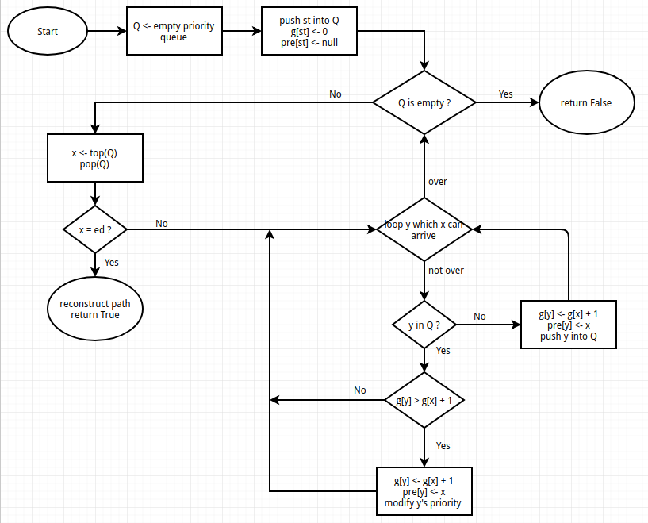
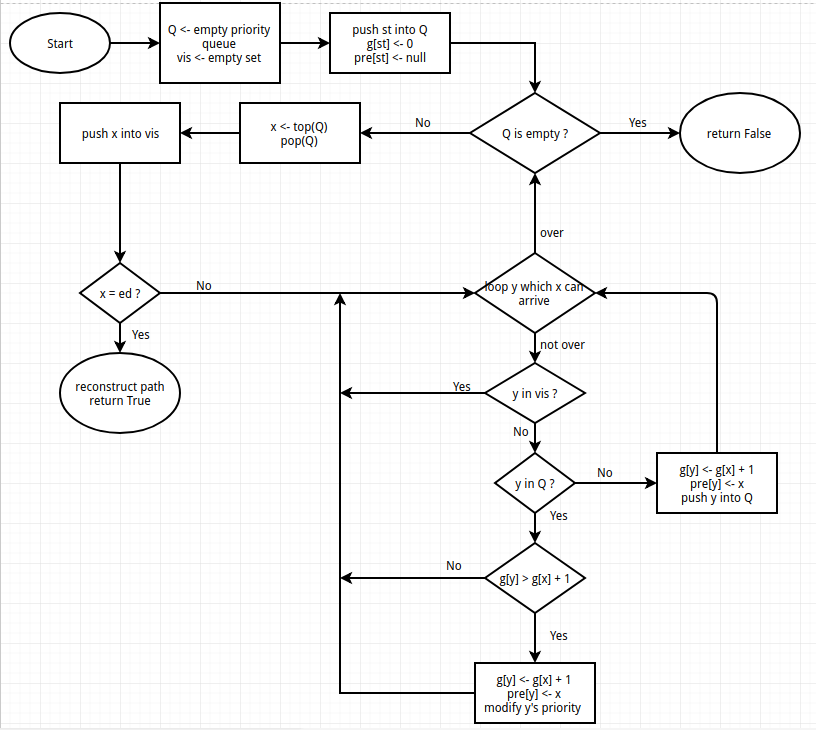
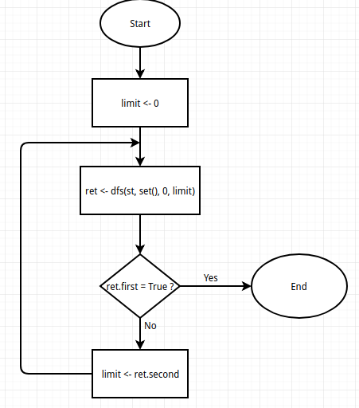
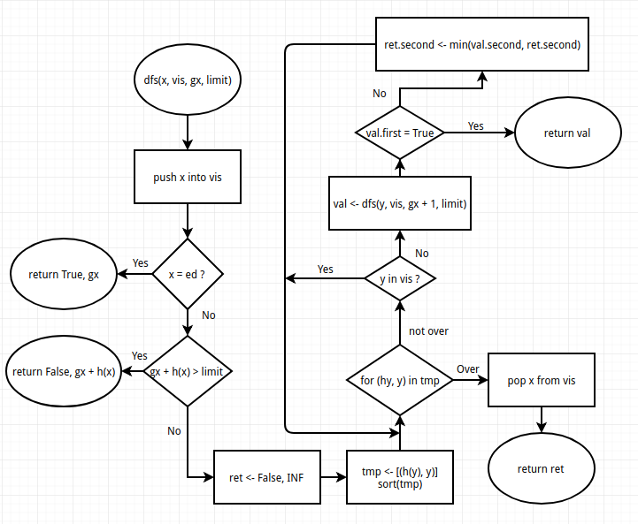

# Report

| 实验内容   | 学号     | 姓名   |
| ---------- | -------- | ------ |
| 启发式搜索 | 16337339 | 朱祎康 |

---

## 算法原理

### A*

A* 算法是一种启发式搜索算法，是**Dijkstra**算法和**BFS**的结合与改进。

A* 算法的实现基于**BFS**，维护一个队列$Q$ 来存放*待拓展节点*，每次从$Q$ 中选取$f$ 值最小的节点拓展。

$$f(x) = h(x) + g(x)$$

其中，$g(x)$ 表示从初始状态$s$到$x$的代价，$h(x)$ 是我们选取的启发式函数。

下面是$h(x)$ 需要满足的两条性质：

$$h(x) \leq h^\star(x), \forall x$$ 

$$h(x) \leq d(x, y) + h(y)$$

如果$h$ 满足第一条，称作$h$ 是**可采纳** 的，如果$h$ 同时满足第二条，称作$h$ 是**单调(一致)**的。

可以证明以下两条定理：

1. 如果$h$ 是可采纳的，那么A* 是完备的（总能找到解）
2. 如果$h$ 是单调的，那么A* 是最优的（找到的第一个解就是最优解）

当$h(x) = 0, \forall x$， A* 算法退化为**Dijkstra** 算法。


普通的A* 算法：

```pseudocode
Function A_star(st)
	Q <- empty priority queue
	push st into Q with priority 0
	g[st] <- 0
	pre[st] <- null
	
	while Q is not empty
		x <- pop Q with lowest priority
		if x = ed
			reconstruct the path from st to ed
			return True
		end
		for all y which x can arrive
			if y in Q
				if g[y] > g[x] + 1
					g[y] <- g[x] + 1
					modify y with priority g[y] + h(y)
				end
			else
				g[y] <- g[x] + 1
				pre[y] <- x
				push y into Q with priority g[y] + h(y)
			end
		end
	end
	return False
end
```



如果$h$ 满足单调性，第一次访问到某个节点$x$，一定就是从起点$s$ 到$x$ 的最优路径。

所以可以维护一个集合，记录已经访问过的节点，如果$y$ 已经访问过，那么不再放入$Q$ 中。

带**环检测**的A* 算法：

```pseudocode
Function A_star(st)
	Q <- empty priority queue
	vis <- empty set
	
	push st into Q with priority 0
	g[st] <- 0
	pre[st] <- null
	
	while Q is not empty
		x <- pop Q with lowest priority
		push x into vis
		if x = ed
			reconstruct the path from st to ed
			return True
		end
		for all y which x can arrive
			if y in vis
				continue
			end
			if y in Q
				if g[y] > g[x] + 1
					g[y] <- g[x] + 1
					modify y with priority g[y] + h(y)
				end
			else
				g[y] <- g[x] + 1
				pre[y] <- x
				push y into Q with priority g[y] + h(y)
			end
		end
	end
	return False
end
```




### IDA*

 IDA* 算法是在**IDS**的基础上改进而来的。

在$dfs$ 的过程中，优先选择$h$ 值小的$y$ 进行拓展。

当$h(x) + g(x) > limit$ ，不再进行拓展。

因为$h(x), g(x)$ 只是一般的实数，所以$limit' \leftarrow \text{min}\ h(y) + g(y)$ 

```pseudocode
Function IDA()
	limit <- 0
	while True
		ret <- dfs(st, set(), 0, limit)
		if ret.first = True
			find the answer
			break
		else
			limit <- ret.second
		end
	end
end

Function dfs(x, vis, gx, limit)
	push x into vis
	
	if x = ed
		return True, gx
	end
	if limit < gx + h(x)
		return False, gx + h(x)
	end
	
	ret <- False, INF
	tmp <- [(h(y), y) for all y which x can arrive]
	sort(tmp)
	for (hy, y) in tmp
		if y in vis
			continue
		end
		val <- dfs(y, vis, gx + 1, limit)
		if val.first
			return val
		else
			ret.second <- min(val.second, ret.second)
		end
	end

	pop x from vis
	return ret
end
```






## 关键代码


## 创新

因为想要构造一个满足**单调性** 的启发函数$h$ 是一件很困难的事情，很多时候$h$ 只能满足**可采纳**性。

这样一来A* 就不能使用**环检测** （将不满足最优性）。

A* 由于是在**BFS**基础上写的，所以也不方便使用路径检测。

但是我们可以使用简化的路径检测：只判断$y = fa(x)$ 。

对于本问题，由于循环链的长度很长，需要很多操作才能回到原来的状态，所以这种剪枝策略是十分有效的。

## 结果分析


## 思考题

